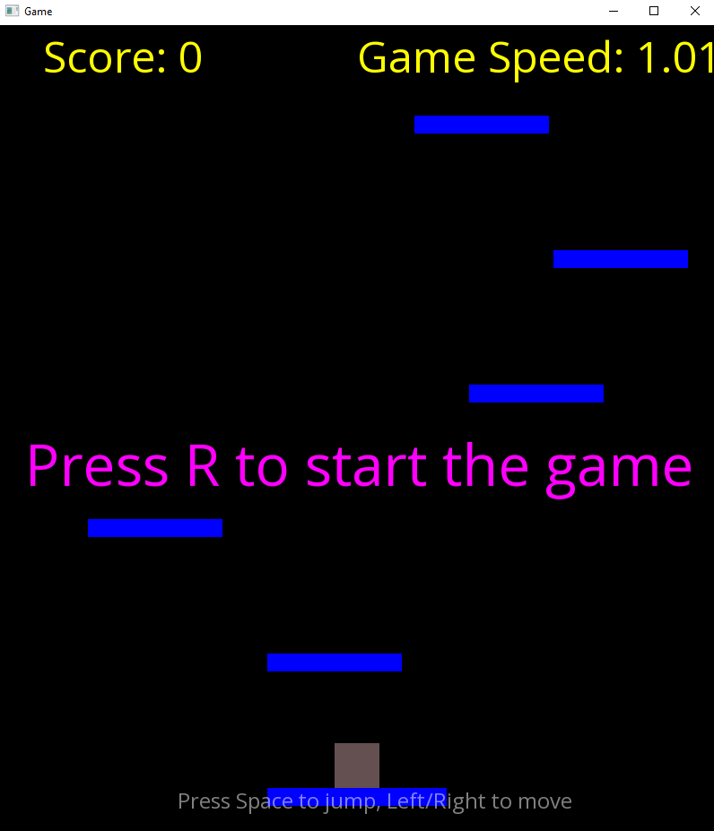

# ♟️ Python Chess Game

🎥 **Demo Video**: [https://youtu.be/ZrVI6uh7e0Y](https://youtu.be/ZrVI6uh7e0Y)

---

## ✨ Features

- Classic chess gameplay  
- Interactive GUI with drag-and-drop support  
- Move validation and check/checkmate detection and pawn promotion  

---

## 🛠 Built With

- **Python 3.11+**  
- **Tkinter**  
- Standard Python libraries (threading, time, etc.)

---
